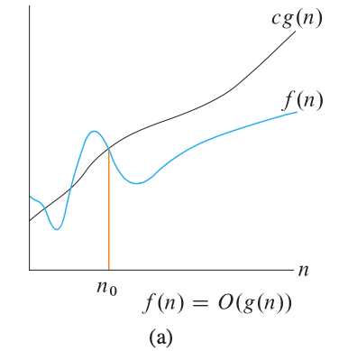
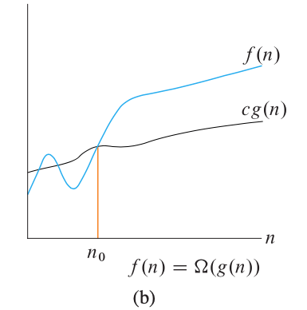
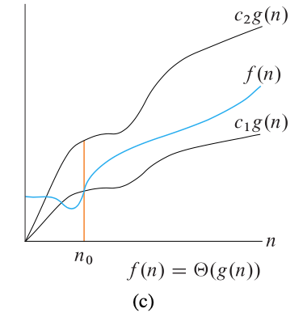

# Introduction

The theoretical study of computation program performance and resource usage.

why it's important:

1. performance measures the line between feasible and infeasible;
2. performance is like the currency that's used to quantify in the software world;

# Asymptotic notations

* $O$-notation

  upper bound on the asymptotic beahavior of a function, meaning a function grows no faster than a certain rate, based on the highest-order term.

  $f(n)=7n^3 + 100n^2 -20n + 6$

  $O(n^3)$

  $O(n^k), k >= 3$

  -formal definition:

  $O(g(n))$={$f(n)$: there exists positive constants $c$ and $n_0$ such that $0\leq f(n) \leq cg(n)$ for all $n \geq n_0$}

  - {$f(n)$} is a **set** of functions that have $O(g(n))$ as its asymptotic upper bound.

  
* $\Omega$-notation

  lower bound on the asymptotic beahavior of a function, meaning a function grows at least as fast as a certain rate, based on the highest-order term.

  $\Omega(n^3)$

  $\Omega(n^k), k<=3$

  -formal definition

  $\Omega(g(n))$={$f(n)$: there exists positive constants $c$ and $n_0$ such that $0\leq cg(n) \leq f(n)$ for all $n \geq n_0$}

  - {$f(n)$} is a **set** of functions that have $O(g(n)) as its asymptotic lower bound.

  
* $\Theta$-notation

  tight bound on the asymptotic beahavior of a function, meaning a function grows precisely at a certain rate, based on the highest-order term.

  $\Theta(n^3)$

  If a function is both $O(f(n))$ and $\Omega(f(n))$ for some $f(n)$, then the function is $\Theta(f(n))$

  -formal definition
  $\Theta(g(n))$={$f(n)$: there exists positive constants $c_1,c_2$ and $n_0$ such that $0\leq c_1g(n) \leq f(n) \leq c_2g(n)$ for all $n \geq n_0$}

  - {$f(n)$} is a **set** of functions that have $O(g(n)) as its asymptotic tight bound.

  
* Insertion sort's running time

  Best case runtime is $\Theta(n)$ and worst case running time is $\Theta(n^2)$.

  so we can say insertion sort's running time is $O(n^2)$ because in all cases it grows no faster than $n^2$;

  or $\Omega(n)$ because in all cases it grows no slower than $n$.

# Solve recurrences

## substitution method

Example:

$T(n) = 4T(n/2) + n$
1. Guess the solution

$T(n) = O(n^2)$

2. Verify by induction(数学归纳法)

Assume
$T(k) \leq ck^2$ for $k \lt n$

Then $$\begin{equation*}
\begin{split}
T(n) & = 4T(n/2) + n \\
    & \leq 4c(n/2)^2 + n \\
    & = cn^2 + n \hspace{50cm}
    \end{split}
\end{equation*}$$
We cannot deduce as above by induction that $T(n) < cn^2$

Let's assume that $T(n)$ has some lower order terms $T(n) = O(n^2) + c_2n$ and subtract the lower order terms from the right based on formal definition of $O$-notation

$T(k) \leq c_1k^2-c_2k$ for $k \lt n$

Then
$$\begin{equation*}
\begin{split}
T(n) & = 4T(n/2) + n \\
    & \leq 4c_1(n/2)^2 - 4c_2(n/2)+ n \\
    & = c_1n^2 - c_2n - (c_2n-n) \\
    & \leq c_1n^2 -c_2n \hspace{50cm}
    \end{split}
\end{equation*}$$
if $c_2 \geq 1$

3. Solve for constants

$c_2 \geq 1$ needs to be satisfied and for base case
$T(1) \leq c_1 - c_2$ needs to hold
so
$c1 \geq T(1) + c_2$

## Recursion tree method

## master method
