[toc]

## 指针类型赋值兼容性检查

赋值操作的约束条件(对于指针)

1. _两个操作数都是指向有限定符或无限定符的相容类型的指针_
2. _左边指针所指向的类型必须具有右边指针所指向类型的全部限定符_

```
#include <stdio.h>

void f(const char** p) {
    printf("dddn");
}

int main(int argc, char** argv) {
    char c = 'a';
    const char d = 'b';
    //char *pd = &d;
    //*pd = 'f';
    *(&d) = 'c';
    printf("%cn", pd);
    char *p = &c;
    const char * q = &d;
    //p = q;
    q = p;
    //f(argv);
    return 0;
}
```

* q=p

q是指向const char的指针, p是指向char的指针

q和p本身没有限定符,满足1;

q指向的类型包含p指向类型的限定符(无),q指向的类型的限定符为const,满足2

所以赋值合法;

* p=q

1满足但是2不满足,类型不兼容,无法赋值.

* p=argv

p是指向const char*的指针, argv是指向char*的指针, p和argv指向的类型都没有限定符, 满足2;

p和argv本身没有限定符但是他们指向的类型是不相容的, const char* 和char*不是相容的类型

## 算术转换

算术转换:

操作数数为算术类型的双目运算符的两个操作数中:

* 有long double,转long double
* 有double,转double
* 有float,转float
* 均为整型进行如下整型升级:
  * char short int 或者int型位段(bit-field), unsigned or signed, enum，如果能用int完整表示(int 为32位),那么上述源类型自动转换为int,否则转换位unsigned int
  * 有unsigned long int,转unsigned long int
  * 无unsigned long int,有一个是long int

    * 另一个是unsigned int, 如果能用long int完整表示unsigned int,转为long int,否则转化为unsigned long int
    * 另一个不是unsigned int,转化为long int
  * 无unsigned long int, 无long int,有一个是unsigned int,转化为unsigned int
  * 两个都为int,不需要整型升级

总结：

* 算术运算的操作数如果类型不同，数据类型会朝着浮点京都更高、长度更长的方向转换，整型如果转为signed不会丢失信息，就转为signed，否则转为unsigned。
* 尽量不要使用无符号类型，除非使用位段或者二进制掩码，另外如果操作数类型不同应当使用强制类型转换。

## 语言缺陷

### 多做之过

C函数可见性默认为全局可见:一个符号要么全局可见,要么对其他文件都不可见;

容易引起interpositioning,即用户编写的同名函数取代了系统的库函数

### 误做之过

* **操作符可能产生歧义**

Sizeof(int) // 针对类型名,需要括号

Sizeof a // 针对变量,不需要

Sizeof *p //不需要

* **运算符的优先级问题**

```
*p.f // *(p.f)，.的优先级高于*， 可以用->操作符消除这个问题
int *ap[] // int *(ap[])，[]高于*，ap是个指向int型数组的指针，而不是元素为int指针的数组int *(ap[])
int *fp() // int *(fp())， 函数()高于*，fp是个函数，无参数返回int*，而不是指向无参数返回int的函数的函数指针int (*fp)()
(val & mask != 0) // ==和!=高于位运算符
c=getchar() != EOF // ==和!=高于赋值操作符
msb << 4 + lsb // 算术运算符高于移位运算符
i = 1, 2 // 逗号操作符优先级最低
```

* **操作数的计算顺序**

```
x = f() + g() * h();
```

大多数编程语言没有规定操作数的计算顺序，之所以未作定义，是为了让编译器充分发挥自身架构的特点，或者充分利用存储于寄存器中的值。因此不要依赖f, g, h的执行顺序。

函数调用中,`f(expr1, expr2, expr3)`各个参数的计算顺序也是不确定的;

`&& ||`计算顺序严格从左到右,短路求值;

* **操作符的结合性**

操作符的结合性在表达式中出现两个以上相同优先级的操作符的时候发挥作用:
    赋值操作符(包括复合赋值操作符)具有右结合性,从右往左执行操作;
    位操作符具有左结合性,从左到右执行操作;

### 少做之过

Lint被从编译器中分离出来了

## c语言的声明

### 声明器(declarator)

就是标识符以及与它组合在一起的任何指针、函数括号、数组下表等,如下表所示(包含了初始化内容):

| 数量               | c语言中的名字                                                                                                   | c语言中出现的形式                                                                                                                                                                                                             |
| ------------------ | :-------------------------------------------------------------------------------------------------------------- | ----------------------------------------------------------------------------------------------------------------------------------------------------------------------------------------------------------------------------- |
| 零个或多个         | 指针                                                                                                            | 下列形式之一<br />    * const volatile<br />                * volatile<br />                       *<br />                * const<br />    * volatile const                                   |
| 有且只有一个       | 直接声明器                                                                                                      | 标识符<br />或： 标识符[下标]<br />或： 标识符(参数)<br />或： (声明器)                                                                                                                                                       |
| 零个或一个         | 初始化内容                                                                                                      | = 初始值                                                                                                                                                                                                                      |
| 至少一个类型说明符 | 类型说明符（type specifier）<br /><br /><br /><br />存储类型（storage-class）<br />类型限定符（type-qualifier） | void char short int long signed<br />unsigned float double <br />结构说明符 struct-specifier<br />枚举说明符 enum-specifier<br />联合说明符 union-specifier<br />extern static register<br />auto typedef<br />const volatile |
| 有且只有一个       | 声明器（declarator）                                                                                            |                                                                                                                                                                                                                               |
| 零个或多个         | 更多的声明器                                                                                                    | ，声明器                                                                                                                                                                                                                      |
| 一个               | 分号                                                                                                            | ；                                                                                                                                                                                                                            |

函数的返回值不能是函数,但是允许是一个函数指针:

```
int * f1() {
    int *a = new int;
    *a = 1;
    return a;
}
typedef int* foo ();

foo* f2() {
    return f1;
}
```

函数的返回值不能是一个数组,但是允许是一个指向数组的指针:

```
typedef int Array_tt [13];
Array_tt ga;
typedef Array_tt& array_ref_t;
array_ref_t f3() {
    for (int i = 0; i < sizeof(Array_tt)/sizeof(ga[0]); ++i) {
        ga[i] = i;
    }
    return ga;
}
```

数组里面不能有函数,但是允许有函数指针; ([]比*优先级更高):

```
typedef int (*foo_array[4])();
typedef foo* (*func_array[3])();
```

数组里面允许有其他数组.

### 结构和联合

union的用法:

```
union bits32_tag {
    int whole; // 一个32位的值
    struct { char c0, c1, c2, c3;} byte; // 4个8位的字节
} value;
```

### 声明中的优先级规则

A 声明从它的名字开始读取，然后按照优先级顺序依次读取，
B 优先级从高到低依次是：
    B.1 声明中被括号括起来的部分
    B.2 后缀操作符；
        括号()表示这是一个函数，而
        方括号[]表示这是一个数组。
    B.3 前缀操作符：星号*表示“指向…的指针"
C 如果const 和（或）volatile 关键字的后面紧跟类型说明符（如int,long等），那么
它作用于类型说明符，在其他情況下，const 和（或）volatile 关键字作用于它左边紧邻的指针

```
char * const *(*next)();
```

next是一个指针,它指向一个函数,该函数返回一个指针,该指针指向一个char类型的常量指针.

```
char *(* c[10])(int **p);
```

c是一个数组,数组中有10个元素,每个元素是一个指针,每个指针指向一个函数,函数的参数为一个指向int型指针的指针,函数的返回值为指向char的指针.

c语言声明解析流程图
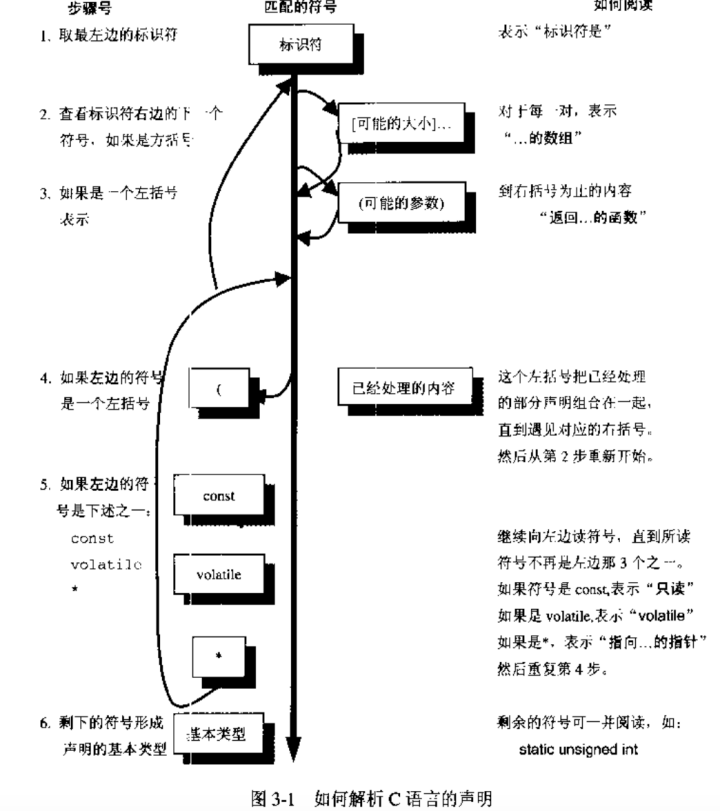

```
/*
Write a Program to Translate C Declarations into English
Here's the design. The main data structure is a stack, on which we store tokens that we have read, while we are reading forward to the identifier. Then we can look at the next token to the right by reading it, and the next token to the left by popping it off the stack. The data structure looks like:
*/
struct token {
    char type;
    char string[MAXTOKENLEN];
};
struct token stack[MAXTOKENS]; /* holds tokens we read before reaching first identifier */
struct token this; /* holds the token just read */

The pseudo-code is:
utility routines----------
    classify_string
        look at the current token and
        return a value of "type" "qualifier" or "identifier" in this.type
    gettoken
        read the next token into this.string
        if it is alphanumeric, classify_string
        else it must be a single character token
        this.type = the token itself; terminate this.string with a nul.
    read_to_first_identifier
        gettoken and push it onto the stack until the first identifier is read.
        Print "identifier is", this.string
        gettoken
parsing routines----------
    deal_with_function_args
        read past closing ')' print out "function returning"
    deal_with_arrays
        while you've got "[size]" print it out and read past it
    deal_with_any_pointers
        while you've got "*" on the stack print "pointer to" and pop it
    deal_with_declarator
        if this.type is '['
            deal_with_arrays
        if this.type is '('
            deal_with_function_args
        deal_with_any_pointers
        while there's stuff on the stack
            if it's a '('      pop it and gettoken; it should be the closing ')'
        deal_with_declarator
            else pop it and print it
main routine----------
    main
        read_to_first_identifier
        deal_with_declarator

source file : cdecl.c
```

### typedef

普通的声明:这个名字是一个指定类型的变量;

typedef声明:这个名字是指定类型的同义词;

```
void (*signal(int sig, void(*func)(int)))(int);
void (*signal( ))(int);
```

signal是一个函数(没有括号先check后面的操作符), 该函数的参数为(整型int, 返回void 以int为参数的函数指针),该函数返回一个如下的函数指针,指向一个返回void以int为参数的函数

```
void (*)(int)
```

用typedef简化signal的类型声明:

```
typedef void(*ptr_to_func)(int);
ptr_to_func signal(int, ptr_to_func);
```

#### typedef定义的类型别名不能进行类型扩展

```
typedef int my_int;
unsigned my_int i; // error
```

#### 注意typedef struct和struct的区别

```
typedef struct fruit_tag {int weight, price_per_lib;} fruit_type;
```

fruit_tag是结构标签要和struct一起使用,fruit_type是结构类型,最好使用结构标签的形式使用结构,这样更清晰.

typedef应该用在

* 数组、结构、指针以及函数的组合类型
* 可移植类型的声明,比如你需要一种至少20bit的类型时,可以对它进行typedef操作,这样移植代码到其他平台只需要修改typedef处的声明
* 简化强制类型转换时需要的类型名字

## 数组和指针

### 声明和定义

声明:可以多次出现,描述对象的类型,用于指代其他地方定义的对象

```
extern int my_array[];
extern int my_array[100];
```

定义:只能出现一次,确定对象的类型并分配内存,用于创建新的对象

```
int my_array[100];
```

### 左值与右值

左值表示地址,存储结果的地方,编译时可知;//数组名属于不可修改的左值;

右值表示地址中的内容,运行时才知;

### 编译器对数组和指针处理的不同

这里关键地方在于,每个符号的地址在编译时可知,所以编译器对这类符号可以直接进行操作,不需要增加指令首先取得具体的地址.相反,对于指针,必须首先在运行时取得它的当前值,然后才能对它进行解除引用操作:
```
char a[9] = "abcdefgh"; char c = a[i];
```
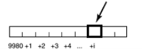

编译器符号表具有一个地址(a) 9980

* 运行时步骤1:取i的值,将它与9980相加

* 运行时步骤2:取地址(9980+i)的内容


因此extern char a[] 与extern char a[100]是等价的,编译器只需要知道起始地址和偏移量,并不需要知道数组的长度;

相反如果声明extern char *p,那么p将是一个指针,它指向的对象是一个字符,为了取得这个字符,必须得到地址p的内容,然后将它作为字符的地址并从这个地址中取得这个字符:
```
char *p;          char c = *p
```
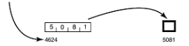


### 定义为指针但是以数组方式引用:
```
char *p = "abcdefgh";  char c = p[i];
```

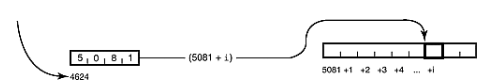

编译器将会：

1. 取得符号表中p的地址，提取存储于此处的指针。
2. 把i所表示的偏移量与指针的值相加，产生一个地址。
3. 访问上面这个地址，取得字符。

编译器己被告知p是个指向字符的指针(相反，数组定义告诉编详器p是一个字符序列 )。 p[i] 表示"从p所指的地址开始 ，前进i步，每步都是一个学符 (即每个元素的长度为个字节)"。如果是其他:类型的指针(如int 或double等)，其步长(每步的字节数)也各不相同.

(类型决定每个地址处的存储空间大小,由于数组元素是连续存储的,因此不同类型的数组的地址步长不同,等于类型的字节数大小)。

### 定义为数组,但是以指针形式声明使用是不合法的:
```
extern char *p; // 声明
char p[10]; // 定义
```

因为数组名本身就代表其地址,如果声明为指针,那么使用的时候就会先取数组名对应的地址中的内容,即为一个ascii字符,再将其作为一个地址取其内容,这样显然是不合理的.

指针相比于数组名的灵活性在于:

指针本身始终位于同一个地址,但是它的内容在任何时候都可以不同,指向不同地址的int变量,这些不同的变量可以有不同的值.

指针指向的是匿名数据,只能用指针进行间接操作.

Table 4-1. Differences Between Arrays and Pointers
|Pointer|Aarray|
|-------|------|
| Holds the address of data|Holds data |
| Data is accessed indirectly, so you first retrieve the contents of the pointer, load that as an address (call it "L"), then retrieve its contents. If the pointer has a subscript [i] you instead retrieve the contents of the location 'i' units past "L"|Data is accessed directly, so for a[i] you simply retrieve the contents of the location i units past a.|
|Commonly used for dynamic data structures |Commonly used for holding a fixed number of elements of the same type of data|
|Commonly used with malloc(), free()|Implicitly allocated and deallocated|
|Typically points to anonymous data |Is a named variable in its own right|

## 链接

编译器是由多个单独程序加编译器驱动器组成的.

C preprocessor -> compiler front end(syntax and context analysis) -> compiler backend(code generator) -> code optimizer -> assembler -> link-loader

使用-v选项查看编译过程中的独立阶段:

➜  c gcc -E cdecl.c -o cdecl.i //预处理

➜  c gcc -S cdecl.i -o cdecl.s //编译

➜  c gcc -c cdecl.s -o cdecl.o //汇编

➜  c gcc cdecl.o -o cdecl.out //链接

### 链接

日标文件并不能直接执行，先需要载入到链接器。链接器确认main函数为初始进入点(程序开始执行的地方)，把符号引用(symbolic reference)绑定到内存地址，把所有的目标文件集中在一起，再加上库文件，从而产生可执行文作。

### 静态链接和动态链接

静态链接:函数库的拷贝被包含到可执行文件中

    链接编辑(link-editing)->载入(loading)

动态链接:可执行文件只包含了文件名,载入器在运行时寻找程序所需的函数库

    链接编辑(link-editing)->载入(loading)->运行时链接(runtime linking)


### 动态链接的优点

1. 可执行文件体积更小,节省磁盘空间和内存,因为函数库只有在需要时才被映射到进程中;
2. 所有动态链接到某个函数库的可知行文件在运行时共享该函数库的一个单独拷贝,如果是静态链接的,那每个可执行文件都会持有一份拷贝;
3. 链接编辑阶段时间更短(但可执行文件的启动速度稍受影响)
4. 能够把程序与它们使用的特定函数库版本分离开来,只要按照约定由系统向程序提供一个稳定接口,该接口不随时间和系统版本而变化. 保证应用程序不会受到和底层系统软件升级的影响.这样函数库的升级将更加容易,而且允许用户在运行时选择需要执行的函数库.

这种介于应用程序和函数库二进制可执行文件所提供的服务之间的接口,被称为应用程序二进制接口(Application Binary Interface, ABI).

### 使用动态链接库

函数库路径:

使用动态链接(just-in-time, JIT)的应用程序在运行时必须能够找到它需要的函数库.连接器通过把库文件名或者路径名植入可执行文件中来做到这一点.所以函数库的路径不能随意移动.

当把可执行文件拿到不同机器上运行时,也需要该机器指定目录上必须存在对应的函数库,对于标准函数库来说这不成问题,因为unix标准要求动态链接必须保证4个特定的函数 库:libc(C运行时函数库)、libsys (其他系统函数)、libX(Xwindowing)和libnsl (网络服务)。

创建动态或者静态链接库:(后缀,静态库.a (archive), 动态库.so (shared object))

编译一些不包含main函数的代码,并将生成的.o文件用工具进行处理(ar, ld,编译器链接工具)

#### 用gcc创建库文件:

先编译得到目标文件:

gcc -c cdecl.c

然后:

gcc -shared -o libcdecl.so cdecl.o

gcc -static -o libcdecl.a cdecl.o

#### 链接现有的库文件:

gcc -L/path/to/library/during/link -R/path/to/library/during/runtime -l<libname withou 'lib'>

gcc main.c -L. -lcdecl

#### 调查链接错误:

nm命令能够显示库文件中的所有符号

nm `<library>` | grep -v UNDEF

排除不在该库文件中定义的symbol

#### 静态链接的另一个问题

静态链接时,各个静态库出现的顺序很重要,链接器时按照从左到右的顺序进行解析的,

gcc -lm main.cc

因为引入math库(如果是静态库)时,还没有出现未定义的符号,所以它不会从math库中提取任何符号,这样连接器在处理main.c中的对math库函数的引用时会出现未定义的错误.

引用动态库不会有这个问题,因为在动态链接中,所有的库符号进入输出文件的虚拟地址空间中,所有的符号对于链接在一起的所有文件都是可见的,但是处理静态链接库时,链接器只是在其中查找载入时当时所知道的未定义符号.

## 运行时

代码和数据有何区别?可以认为它们的区别是编译时和运行时的分界线.

编译时翻译代码,运行时进行数据存储管理

#### a.out

assember output的缩写.

可以有不同的格式:

ELF(extensible linker format, executable and linking format)

COFF(common object-file fomrat)

#### 段

unix下的段:

    一个二进制文件相关的内容块(可能包含多个节,section).

intel x86内存模型中的段:

    一种组织内存地址空间的设计概念,地址空间被分成一些64k大小的区域,称之为段.

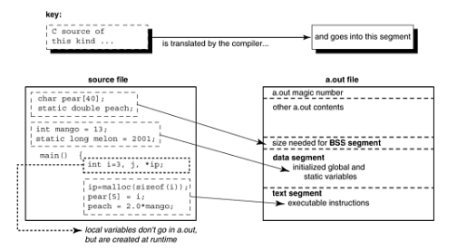

bss(block started by symbol)只保留没有值的变量,所以它实际上并不需要保存这些变量本身而只是记录了它们所需的大小.

#### 操作系统在a.out里做了什么

可执行文件的段在运行时会被载入器读入到内存中,每个区域有特定目的:

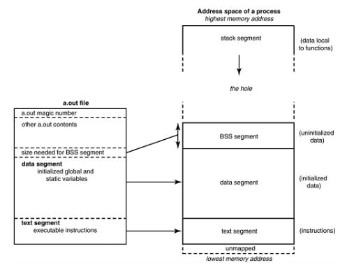

* 文本段包含程序指令,它直接被拷贝到内存中(一般使用mmap()系统调用).文本段的内容和大小一般不会改变,因此有些操作系统可以给段中不同section设定读写属性

    如设定文本段为read-and-execute-only

    设定某些数据为read-write-no-execute,另一些数据为read-only等.

* 数据段包含初始化的全局和静态变量和它们的值.

    bss段包含未初始化的全局和静态数据,紧随数据段之后,这部分内存区域在运行时会全部清0

    数据段+bss段统称为数据区,数据区就是一片连续的虚拟地址空间,一般情况下,任何进程中数据区都是最大的段.

* 堆栈段(stack segment)用于保存局部变量、临时数据、传递到函数中的参数等.

* 堆空间(heap)用于动态分配内存

虚拟地址空间的最低部分并未被映射,所以这部分位于进程的地址空间内但并未赋予物理地址,任何对它的引用都是非法的,典型情况下这部分是从地址0开始的几k字节,它用于捕捉使用空指针和小整型值的指针引用内存的情况.

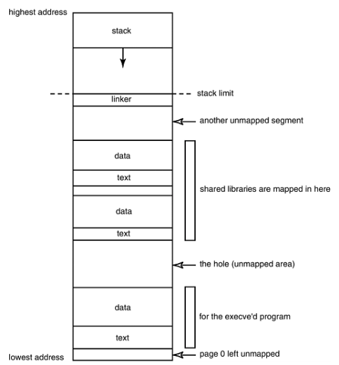

#### c语言运行时在a.out里做了什么

**stack segment**

- local(automatic) variables inside functions
- housekeeping info for function calls, known as stack frame or procedure activation record
- address from which function call is made, where it will return later
- parameters that won't fit into registers
- stored register values
- temporary storage

for example:

- arithmetic expression results
- allocal() uses storage from stack

stack is needed in C because recursive function calls are allowed.

simple program to print address of different segments:
```
#include <stdio.h>
#include <stdlib.h>
int x = 0;
int y;
int main()
{
    int a[3] = {0, 0, 0};
    int i;
    int j;
    int d[2] = {1,1};
    int *h = malloc(sizeof(int)*2);

    printf("sizeof pointer %ldn", sizeof(h));
    printf("sizeof int %ldn", sizeof(int));
    printf("array a %p %p %p %pn", &a, &a[0], &a[1], &a[2]);
    printf("array d %p %p %pn", &d, &d[0], &d[1]);
    printf("stack %p %p %p %p %p %pn", &a, a, d, &i, &j, &h);
    printf("heap %pn", &h[0]);
    printf("bss %pn", &y);
    printf("data %pn", &x);
    long daddr = &x;
    daddr -= sizeof(x);
    printf("text %sn", (const char*)daddr);
    return 0;
}

sizeof pointer 8
sizeof int 4
array a 0x7ff7be7d156c 0x7ff7be7d156c 0x7ff7be7d1570 0x7ff7be7d1574
array d 0x7ff7be7d1564 0x7ff7be7d1564 0x7ff7be7d1568
stack 0x7ff7be7d156c 0x7ff7be7d156c 0x7ff7be7d1564 0x7ff7be7d155c 0x7ff7be7d1558 0x7ff7be7d1550
heap 0x6000003b0040
bss 0x101736004
data 0x101736000
text
```

#### what happens when a function gets called

**stack frame (procedure activation record)**

/usr/include/sys/frame.h

https://svnweb.freebsd.org/base/head/sys/x86/include/frame.h?revision=247047&view=markup

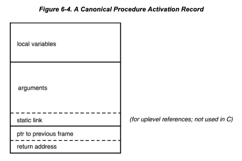

C doesn't have static link to upper enclosing procedure, with which can be used to access upper level stack frame and hence the data local to it. Thus C doesn't support nested functions (define function inside function).

It's called static link because it's decided at compile time, while the frame pointer chain is dynamic linked in which the pointer is pointing to previous procedure at runtime).

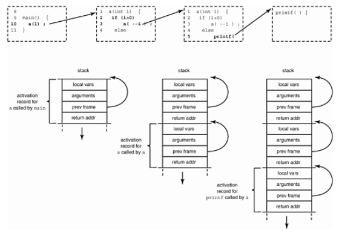

The pointer to previous frame makes it easier for popping the stack back to previous record when current function returns. (as different record would have different size).

**static and auto**

- Knowing that stack will be popped after the function returns, you should never return pointers to a local variable declared inside the function. Use static variables or heap memory instead.
- auto in C language means that the variable's storage will be allocated automatically, compared to statically allocated at compile time or dynamically allocated on heap. It can only be used inside a function but variable declaration enables that attribute by default.

so actually auto is not needed for C programmers.

#### stack frames could be on registers/ heaps besides stack.

#### Threads of control

For threads, each will have a separate stack for its control of function calls.Each thread gets a stack of 1Mb (grown as needed) and a page of red zone betweeen each thread's stack.

#### setjmp and longjmp

Setjmp saves a copy of the **program counter** and the **current pointer to the top of the stack**. This saves some initial values, if you like. Then longjmp restores these values, effectively transferring control and resetting the state back to where you were when you did the save. It's termed " **unwinding the stack** ," because you unroll activation records from the stack until you get to the saved one. Although it causes a branch, longjmp differs from a goto in that:

- A **goto can't jump out of the current function in C** (that's why this is a "longjmp"— you can jump a long way away, even to a function in a different file).
- You **can only longjmp back to somewhere you have already been, where you did a setjmp** , and that still has a live activation record. In this respect, setjmp is more like a "come from" statement than a "go to". Longjmp takes an additional integer argument that is passed back, and lets you figure out whether you got here from longjmp or from carrying on from the previous statement.

A setjmp/longjmp is most useful for **error recovery**. As long as you haven't returned from the function yet, if you discover a unrecoverable error, you can transfer control back to the main input loop and start again from there. Some people use setjmp/longjmp to return from a chain of umpteen functions at once. Others use them to shield potentially dangerous code, for example, when dereferencing a suspicious pointer as shown in the following example.
```
typedef void(*ptr_to_func)(int);
ptr_to_func signal(int, ptr_to_func);
#include <signal.h>
#include <setjmp.h>
#include <stdio.h>
jmp_buf jbuf;
void
termination_handler (int signum)
{
    printf("we are going to longjmp back to switch\n");
    longjmp(jbuf, 1);
}

int main (int argc, char** argv)
{
    if (signal (SIGSEGV, termination_handler) == SIG_IGN)
        signal (SIGSEGV, SIG_IGN);
    char *p;
    //*p = 'b'; // pointers to literals are forbidden

    char* ss = "hello world"; // pointers to string literals are ok
    // char* suspicious = &a;
    char *suspicious = 0;
    char d = 'e';
    volatile char f = 'g';
    printf("before d = %c f = %c\n", d, f);
    char c;
    switch(setjmp(jbuf)) {
        case 0:
            d = 'f';
            f = 'h';
            printf("suspicious: %c\n", *suspicious);
            break;
        case 1:
            printf("after d = %c f = %c\n", d, f);
            printf("suspicious is indeed a bad pointer\n");
            break;
        default:
            printf("unexpected value returned by setjmp\n");
    }
    return 0;
}

➜ gcc setjmp.c && ./a.out

before d = e f = g
we are going to longjmp back to switch
after d = f f = h
suspicious is indeed a bad pointer
```

Following command checks default stack limit:
```
using ulimit -s `<size>` to reset stack limit
➜  ulimit -a
-t: cpu time (seconds)              unlimited
-f: file size (blocks)              unlimited
-d: data seg size (kbytes)          unlimited
**-s: stack size (kbytes)             8192**
-c: core file size (blocks)         0
-v: address space (kbytes)          unlimited
-l: locked-in-memory size (kbytes)  unlimited
-u: processes                       2784
-n: file descriptors                2560
```

#### useful tools under linux

**nm** Prints the symbol table of an object file

**strings** Looks at the strings embedded in a binary. Useful for looking at the error messages a binary can generate, built-in file names, and (sometimes) symbol names or version and copyright information.

**sum** Prints checksum and block count for a file. An-swers questions like: "Are two executables the same version?" "Did the transmission go OK?"

**file** Tells you what a file contains (e.g., executable, data, ASCII, shell script, archive, etc.).

**time** Displays the total real and CPU time used by a program.

## Memory

#### Intel x86 memory models

A segment in the Intel x86 memory model is the result of a design in which (for compatibility reasons)

**the address space is not uniform, but is divided into 64-Kbyte ranges known as segments**.

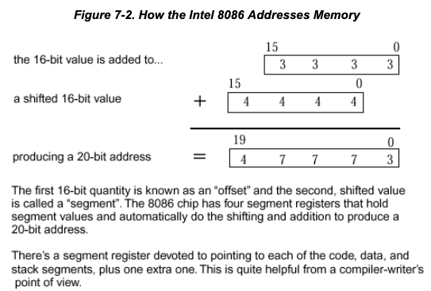

8086 has 16bits on the data bus and 20bits on the address bus.

the 20 bits is not a usual design decision, main thought is to keep backward compatibility for 8085-ported code. All subsequent 80x86 processors had to follow it or give up compatibility.

For 8085 programs, the segment registers are loaded with fixed values and then ignored, the 16bits address for 8085 will be used directly;

For 8086 programs, the segment registers are used to **firstly point to on the 8086 a 64-Kbyte region of memory** , An address is formed by taking the value in a segment register and shifting it left four places (or equivalently, multiplying by 16). Yet a third way of looking at this is to consider that the segment register value has been made a 20-bit quantity by appending four zeros.

**Then** the **16-bit offset says where the address is in that segment(the 64-Kbyte region)**. If you add the contents of the segment register to the offset, you will obtain the final address.

#### virtual memory

If it's there and you can see it—it's real
If it's not there and you can see it—it's **virtual**
If it's there and you can't see it—it's **transparent**
If it's not there and you can't see it—you erased it!
—IBM poster explaining virtual memory, circa 1978

Virtual memory is organized into " **pages**." A page is the unit that the OS moves around and protects, typically a few Kbytes in size. When a memory image travels between disk and physical memory we say it is being **paged in (if going to memory**) or **paged out (going to disk)**.

**paged out** - When process is not actually running(sleeping) or with a low priority, the physical memory resources allocated to it can be taken away and backed up on the disk, it is called to be " **swapped out**". There is a special " **swap area**" on disk that holds memory that has been paged or swapped. The swap area will usually be several times bigger than the physical memory on the machine.

**paged in** - A process can only operate on pages that are in memory. When it makes are reference to a page not in memory, MMU(Memory Management Unit) generate a **page fault.** Kernel will respond and check if the reference was valid or not. If invalid it signals "segmentation violation" to the process. If valid the kernel retrieves the page from disk and the process can continue to run.

Operating systems(SunOS) has a unified view of disk systems and main memory. It uses identical underlying data structure ( **vnode** , 'virtual node') to manipulate each. The **virtual memory operations are** organized around the single philosophy of **mapping a file region to a memory region**. This is also called "hat layer" - hardware address translation layer.

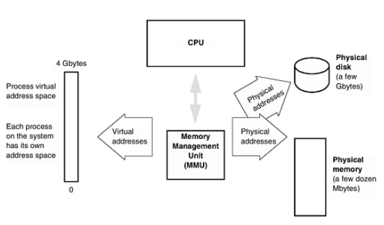

#### cache

**-where is cache located**

-CPU side of the MMU, **caches virtual address** , must be flushed on each context switch(as the address is relative not absolute)

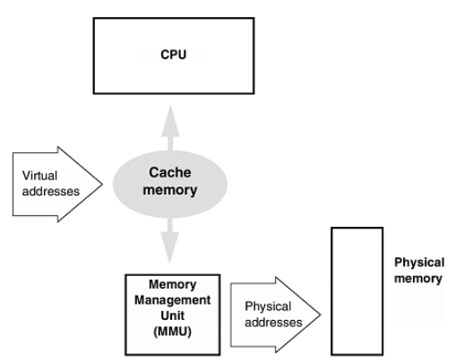

-physical memory side of the MMU, **caches physical address**

**- why cache**

-faster than main memory

-but also more expensive and consumes more space and power than regular memory

**- how is it cached**

-contains list of addresses and their contents

- read operation(request data from a particular address): read from cache first, hand over data back if it's already in cache, otherwise access from main memory and put it into cache
- write operation(write data to a particular address): two types of write cache method, both will not block the instruction stream which will continue as soon as the cache access completes.
- **Write-through** cache— This always initiates a write to main memory at the same time it writes to the cache.
- **Write-back** cache— In the first instance, this writes only to cache. The data is transferred to main memory when the cache line is about to be written again and a save hasn't taken place yet. It will also be transferred on a context switch to a different process or the kernel.

**cache is widely used**

caches also can be applied **whenever there is an interface between fast and slow devices** (e.g., between disk and memory). PC's often use a main memory cache to help a slow disk. They call this "RAMdisk". In UNIX, disk inodes are cached in memory. This is why the filesystem can be corrupted by power-ing the machine off without first flushing the cache to disk with the "sync" command.

**cache internal format**

Line: block(data content, typical size is 32 bytes), tag(address it represents)

Line

Line

Moving of cache-block-sized chunks of data is more efficient.

**an cache missing example**

#### The data segment and heap

malloc -get memory from heap and return pointer pointed to memory on heap

- **everything on heap is anonymous** , you can't access it directly by name, only indirectly through a pointer

free -give memory back to heap

alloc -like malloc but clears memory allocated to zero

realloc -changes size of a block of memory pointed to

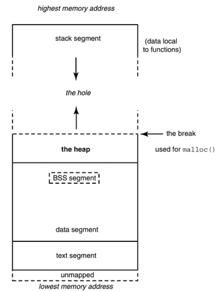

malloc and free— get memory from heap and give it back to heap

- Malloced memory is always aligned appropriately for the largest size of atomic access on a machine, and a malloc request may be rounded up in size to some convenient power of two. **Freed memory goes back into the heap for reuse, but there is no (convenient) way to remove it from your process and give it back to the operating system**.
- Heap memory doesn't need to be returned in the same order in which is was acquired(it doesn't have to be returned at all), the unordered malloc/free calls will eventually cause **heap fragmentation**. To manage heap memory some kind of linked list of available blocks are used and each block handed to malloc is preceded by a size count(how big is the blocks in this list) that goes with it.

brk/sbrk

- system calls that **adjust the size of the data segment to an absolute value/by an increment** , will be called by malloc underneath when process requires more memory than what current heap already has. When called the break pointer(end of the heap) will be pushed further and data segment will grow upwards(to higher address).

-Don't call brk/sbrk by yourself, it may accidentally return data segment memory to the kernel

-If you want to obtain memory that can later be returned to the kernel, use the **mmap** system call to map the /dev/zero file. To return this memory, use **munmap**.

#### Memory leaks

As described in previous section, the heap grows when malloc is called for more memory. If free is not called for each malloc, the process will lose the reference it has (the returned pointer) for that part of memory on heap and as a result it will not be free-able or reusable any more for that process. This inefficiency of memory usage for this process.

Most majority of OS will clean up process memory (including heap) when process exits, but there're exceptions.

alloca() : allocates memory on stack - not portable

#### 总线错误

bus error(core dumped) 总线错误(信息已转储)

segmentation fault (core dumped) 段错误(信息已转储)

错误就是 **操作系统所检测到的异常** ，而这个异常是尽可能地以操作系统方更的原则来报告的。总线错误和段错误的准确原因在不同的操作系统版本上各不相同。

当硬件告诉操作系统一个 **有问题的内存引用时，就会出现这两种错误** 。操作系统通过问 出错的进程发送一个信号与之交流。信号就是一种事件通知或一个软件中断，在UNIX系统 编程中使用很广，但在应用程序编程中几乎不使用。在缺省情况下，进程在收到"总线错误" 或"段错误" 信号后将进行 **信息转储** 并终止。不过可以为这些信号设置—一个信号处理程序 (signal handler)，用于修改进程的缺省反应。

**-**** 总线错误**

由于 **未对齐的内存读写导致**.对齐(alignment)的意思就是数据项只能存储在地址是数据项大小的整数倍的内存位置上.

在现代的计算机架构中，尤其是RISC 架构，都需要数据对齐，因为与任意的对齐有关的额外逻辑会使整个内存系统更大且更慢。通过迫使每个内存访问局限在一个Cache 行或一个单独的页面内，可以极大地简化 (并加速)如Cache控制器和内存管理单元这样的硬件。

例 如 ，访 问 一 个 8 字 节 的 d o u b l e 数 据 时 ，地 址 只 允 许 是 8 的 整 数 倍 。所 以 一个 d o u bl e 数据可以存储于地址:24、8008或32768，但不能存储于地址1006 (因为它无法被8整除)。

**-**** 段错误**

segmentation violation一般由于引用一个未初始化或非法值的指针引起的。有各种原因可能导致指针的值为非法的，所以段错误一般不能提示引起错误的原因，而且如果指针的值恰好是未对齐的值，那么它会产生总线错误而不是段错误（CPU向MMU发送地址之前会先检察它是否对齐）。

几种常见导致segv的原因：

1. 解引用值非法的指针；
2. 解引用空指针；
3. 未取得权限时进行访问；
4. 栈或者堆空间被用完了

## 原型

#### ANSI C标准中的类型提升

除了寻常算术转换之外，表达式中会发生类型提升：

在表达式中，每个char都被转换为 int..注意所有位于表达式中的float 都被转换为 double..

整型提升就是char，short int和位段类型（无论signed 或 unsigned）以及枚举类型将被提升为int，前提是 int 能够完整地容纳原先的数据，否则将被转换为 unsigned int. ANSI C 表示如果编译器能够保证运停结果一致，也可以省略类型提升,这通常出现在表达式中存任常量操作数的时候。

**编译器可以在保证结果不发生溢出的情况下省略类型提升** ：

类型提升是简化编译器的一种想法，通过把所有的操作数转换为统一的长度简化了代码的生成，这样，压到堆栈中的参数都是同一长度的，运行时系统只需要知道参数的数目而不需要知道它们的长度。

#### 不需要按回车就从输入捕获字符
Unix上终端输入的字符是被‘cooked’之后才传给运行的程序的。cooked模式下，行编辑字符，例如backspace，delete等能够使用而且它们不会被传给程序。通常情况下这是期望的行为，但是这导致terminal输入只能整行被读入，而且需要return确认行输入。
如果需要捕获单个字符而不需要按enter，有以下几种方式：
* khbit，只有有些系统支持
* getch/getche MSVC/BorlandC支持
* Unix下修改终端字符读入模式
    ```
    #include <stdio.h>
    int main()
    {
        int c;
        /* The terminal driver is in its ordinary line-at-a-time mode */
        system("stty raw");

        /* Now the terminal driver is in character-at-a-time mode */
        c = getchar();
        system("stty cooked");   /* The terminal driver is back in line-at-a-time mode */
        putchar(c);
        return 0;
    }
    ```
* 使用 `ioctl`系统调用轮询输入字符
    Raw I/O mode使得程序阻塞在读入字符处`c=getchar()`，如果不想阻塞在这里而是可以使用`ioctl`系统调用获取是否有字符输入。下面的程序使用`ioctl`查询是否有字符输入，只有有字符输入的时候才去读取（`c=getchar()`）。这种类型的I/O被称为轮询`polling`，意为程序持续通过系统调用查询设备是否有输入。
    ```
    #include <sys/ioctl.h>
    int kbhit()
    {  int i;
        ioctl(0, FIONREAD, &i);
        return i; /* return a count of chars available to read */
    }
    int main()
    {
        int i = 0;
        int c='';
        system("stty raw -echo");
        printf("enter 'q' to quit \n");
        for (;c!='q';i++) {
            if (kbhit())
            {
                c=getchar();
                printf("\n got %c, on iteration %d",c, i);

            }
        }
        system("stty cooked echo");
    }
    ```
* 使用基于中断的I/O获取输入字符
1.Create a signal handler routine that will be invoked to read a character when the OS sends a signal that one is ready. The signal to catch is SIGPOLL.
2.The signal handler should read a character, and also reset itself as the handler for this signal each time it is invoked. Have it echo the character it just read, and quit if it was a 'q'. Note: this is just for teaching purposes. In practice the results are usually undefined if you call any standard library function from within a signal handler.
3.Make an ioctl() call to inform the OS that you require a signal to be sent every time input comes in on the standard input. Look at the manpages for streamio. You will need a command of I_SETSIG and an argument of S_RDNORM.
4.Once the signal handler has been set up, the program can do something else until input comes in. Have it increment a counter. Print the value of the counter in the handler routine.

Every time a character is sent from the keyboard, the SIGPOLL signal will be sent to the process. The signal handler will read the character, and reset itself to be the handler.

    基于中断的I/O允许程序在I/O未就绪时处理其他事情，这称为异步I/O. 使用异步I/O捕获字符：
    1. 创建handler并将其注册为信号SIGPOLL的signal handler
    2. 通过ioctl系统调用通知OS给程序发送字符输入的信号
    ```
    #include <errno.h>
    #include <signal.h>
    #include <stdio.h>
    #include <stropts.h>
    #include <sys/types.h>
    #include <sys/conf.h>
    int iteration=0;
    char crlf []={0xd,0xa, 0};
    void handler(int s)
    {
        int c=getchar(); /* read a character */
        printf("got char %c, at count %d %s",c,iteration,crlf);
        if (c=='q') {
            system("stty sane");
            exit(0);
        }
    }
    int main()
    {
        sigset(SIGPOLL, handler); /* set up the handler */
        system("stty raw -echo");
        ioctl(0, I_SETSIG, S_RDNORM); /* ask for interrupt driven input */
        for(;;iteration++);      /* can do other stuff here */
    }
    ```
#### 用C语言实现有限状态机
<a href="/Users/huzeyu/Desktop/c/cdecl_state.c" title='cdecl_state.c'>cdecl_state.c</a>

#### 强制类型转换
类型转换：
```
(float) 3 // 数据的实际二进制位发生了改变，从整型变为浮点型
```
消除类型歧义：
```
(float) 3.0 // 一开始就使用浮点型数据的位模式
```
复杂类型的强制转换：
```
void qsort(void* base, size_t nel, size_t width, int (*compare)(const void*, const void*));
int intcompare(const in*i, const int* j) {
    return (*i - *j);
}
qsort(a, 10, sizeof int, (int (*(const void*, const void*))) intcompare);
```
## More about arrays

### 数组被编译器当作指针的情形
* 表达式中的数组名就是指针*
```
int a[10], *p, i=2;
// then a[i] can equally be accessed in any of these ways:  p=a;   p[i];
p=a;  *(p+i);
p=a+i;    *p;

// even below is llegal though it's bad practice
a[6];
6[a];
```

* C语言把数组下标作为指针的偏移量*
这么做的根本原因是指针和偏移量是底层硬件所使用的基本模型

* 作为函数参数的数组名等同于指针
```
my_function( int * turnip ) {...}
my_function( int turnip[] ) {...}
my_function( int turnip[200]){...}
```
### 数组的数组
C语言默认行主序，也就是说最右边的下标先增加
```
int a[2][3]
最低地址 <--------> 最高地址
a[0][0] a[0][1] a[0][2] a[1][0] a[1][1] a[1][2]
列主序
a[0][0] a[1][0] a[0][1] a[1][1] a[0][2] a[1][2]

只能在数组声明时对其进行整体初始化，用嵌套花括号对数组的数组进行初始化，此时可以省略最左边的下标的长度（编译器会根据初始化值的个数自动推断）。如果数组的长度比初始化值的个数多，会进行默认初始化（0值或者空指针）。
```
short cantaloupe[2][5] = {  {10, 12, 3, 4, -5},   {31, 22, 6, 0, -5},  };
int rhubarb[][3] ={ {0,0,0}, {1,1,1}, };
```
字符串常量可以用来初始化二维字符数组或者字符指针数组：
```
char vegetables[][9] = { "beet",                           "barley",                           "basil",                           "broccoli",
"beans" };
char *vegetables[] = { "carrot",                         "celery",                         "corn",                         "cilantro",
"crispy fried potatoes" };
```
但是其他类型的指针数组（非字符指针数组）不能直接这样初始化：
```
int *weights[] = {           /* will NOT compile successfully */
{1,2,3,4,5},
{6,7},
{8,9,10}
};           /* will NOT compile successfully */
可以逐行初始化：
int row_1[] = {1,2,3,4,5,-1}; /* -1 is end-of-row marker */
int row_2[] = {6,7,-1};
int row_3[] = {8,9,10,-1};
int *weights[] = {
row_1,
row_2,
row_3
};
```
